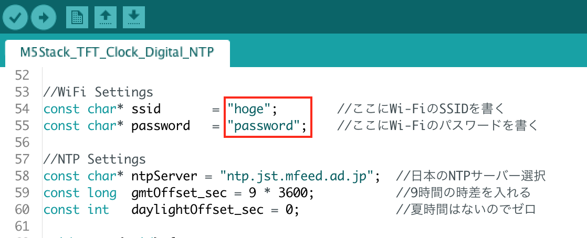

# M5Stack デジタル時計(NTP対応)

## はじめに

[M5Stack User Group Japan](https://www.facebook.com/groups/154504605228235/)の[M5Stack初心者向けハンズオン vol.2](https://m5stack.connpass.com/event/93961/)参加時のお題である、正確な時計をM5StackサンプルスケッチのTFT_Clock_Digitalをベースに改造しました

## Wi-Fi設定について

下記のスケッチ箇所の赤枠を書き換えてください。

## 参考サイト

* [ESP32 NTPを使って時刻をGET](https://qiita.com/coo0659/items/13d36668b2037e38f834)
* [WiFi接続とNTPクライアントの実験(ESP-WROOM-32)](https://garretlab.web.fc2.com/arduino/esp32/lab/ntp/index.html)